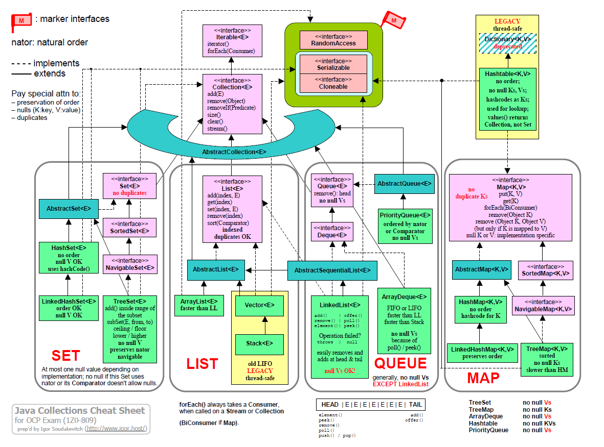

# 10 вопросов по java.util.Collection

1. Назовите основные интерфейсы фреймфорка Collection ?

<details>
  <summary>Ответ</summary>



</details>

2. Почему Map не расширяет интерфейс Collection ?

<details>
  <summary>Ответ</summary>

---

- Map представляет собой key-value storage

---
</details>

3. Какой тип данных можно использовать в качестве ключа Map,
   что является лучшим кандидатом для использования в качестве ключа, ответ аргументируйте ?

<details>
  <summary>Ответ</summary>

---

- Тип данных Key, должен выполнять контракт hashCode() и equals().

- Лучшим кандидатом является Immutable Class

---
</details>

4. Какие реализации интерфейса Set Вы знаете, какие их основные особенности ?

<details>
  <summary>Ответ</summary>

---

- HashSet
    - no order
    - NULL Value OK
    - uses hashCode()
- LinkedHashSet
    - order OK
    - NULL Value OK
- TreeSet
    - no NULL Value
    - preserves natural order
    - navigable

---
</details>

5. Какие представления коллекций можно получить из Map ?

<details>
  <summary>Ответ</summary>

---

- Entry Set

```java
        Map<String, LocalDate> map=new HashMap<>();

        Set<Map.Entry<String, LocalDate>>entries=map.entrySet();

        for(Map.Entry<String, LocalDate> e:entries){
        String key=e.getKey();
        LocalDate value=e.getValue();
        }
```

- Key Set

```java
        Map<String, LocalDate> map=new HashMap<>();

        Set<String> keys=map.keySet();

        boolean isRemoved=keys.remove("key");
        boolean isContains=keys.contains("key");
```

- Values collection

```java
        Map<String, LocalDate> map=new HashMap<>();

        Collection<LocalDate> values=map.values();

        boolean isRemoved=values.remove("key");
        boolean isContains=values.contains("key");
```

Все изменения на view отражаются на исходной Map

Для Iterator соблюдается принцип fail-fast. (Модификация(только удаление) доступна только в самом Iterator)

---
</details>

6. Как устроена работа Priority Queue ?

<details>

  <summary>Ответ</summary>

---

Основана на массиве   
Приоретет определяется на основе Comparator или Comparable (возможен ClassCustException)

---

</details>

7. Когда необходимо использовать TreeMap ?

<details>
  <summary>Ответ</summary>

---
Когда необходимо <K,V> хранилище с отсортированными элементами;
(default ASC)

Порядок определяется в соответствии с Comparator  
или natural order по Comparable (возможен ClassCustException)

Структура данных: КРАСНО-ЧЁРНОЕ ДЕРЕВО, complexity:  O(log(n))  
NULL key OK - если Comparator допускает

Вставка по KEY сохраняет последний вставленный элемент

---
</details>

8. Чем отличается LinkedList от ArrayDeque ?
9. Чем отличаются synchronized коллекции от concurrent ?
10. Какие concurrent коллекции Вы знаете, и при каких условиях их применение будет оптимальным ?
11. Что такое инвариантность, ковариантность и контрвариантность ?

<details>

  <summary>Ответ</summary>

---

At heart, these terms describe how the subtype relation is affected by type transformations.  
(По сути, эти термины описывают, как отношение подтипов зависит от преобразования типов.)  
То есть, если

* A and B are types,
* f a type transformation, and
* ≤ the subtype relation (i.e. A ≤ B means that A is a subtype of B),


* f является **КОВАРИАНТНЫМ**, если A ≤ B подразумевает, что f(A) ≤ f(B)
* f является  **КОНТРАВАРИАНТНЫМ**, если A ≤ B подразумевает, что f(B) ≤ f(A)
* f является **инвариантным**, если ни одно из вышеперечисленных не выполняется

```java 
// КОВАРИАНТНОСТЬ
List <? extends Animal> animals = new ArrayList<Cat>();
Animal a = animals.get(0);

animals.add(new Cat()) // compiler error
animals.add(null) // good

```

```java 
// КОНТРВАРИАНТНОСТЬ
List <? super Animal> animals = new ArrayList<Animal>();
Object a = animals.get(0);

// adds Animal and child
animals.add(new Cat())
animals.add(null)

```

</details>

12. Generics: extends, super , wildcard

<details>

  <summary>Ответ</summary>

---
< ? extends Number >  - под вопросом имеем ввиду не любой тип, а любой тип, но который является подтипом типа Number.

При этом ограничение на операцию PUT сохраняется т.к под вопросом (?) могут пониматься и Integer, и Double и др. - нет
однозначности.

```java
public class WildcardExtendsSuperOverview {
    public static void main(String[] args) {
        /**
         *    Type
         */
        {
            List numbers = new ArrayList<>(Arrays.asList(1, 2, 3));
            Object number = numbers.get(0);
            print(number);

            // adds ALL
            numbers.add(100);
            numbers.add(new Object());
            numbers.add(new ArrayList<>());

            numbers.add(null);
        }
        /**
         *    Type <?>
         */
        {
            List<?> numbers = new ArrayList<>(Arrays.asList(1, 2, 3));
            Object number = numbers.get(0);
            print(number);

            /*
            numbers.add(100); // adds ALL compiler error
             */

            numbers.add(null);
        }
        /**
         *    Type <Number>
         */
        {
            List<Number> numbers = new ArrayList<>(Arrays.asList(1, 2, 3));
            Number number = numbers.get(0);
            print(number);

            // adds Number and child
            numbers.add(Integer.valueOf(10000));
            numbers.add(Long.valueOf(10000));
            numbers.add(Short.valueOf((short) 127));

            numbers.add(null);
        }
        /**
         *    Type <? extends Number>
         */
        {
            List<? extends Number> numbers = new ArrayList<>(Arrays.asList(1, 2, 3));
            Number number = numbers.get(0);
            print(number);

            /*
            numbers.add(100); // compiler error
             */

            numbers.add(null);
        }
        /**
         *    Type <? super Number>
         */
        {
            List<? super Number> numbers = new ArrayList<>(Arrays.asList(1, 2, 3));
            Object number = numbers.get(0);
            print(number);

            // adds Number and child
            numbers.add(Integer.valueOf(10000));
            numbers.add(Long.valueOf(10000));
            numbers.add(Short.valueOf((short) 127));

            numbers.add(null);
        }
    }

    private static void print(Object... args) {
        System.out.println(Arrays.toString(args));
    }
}
```

---

</details>

